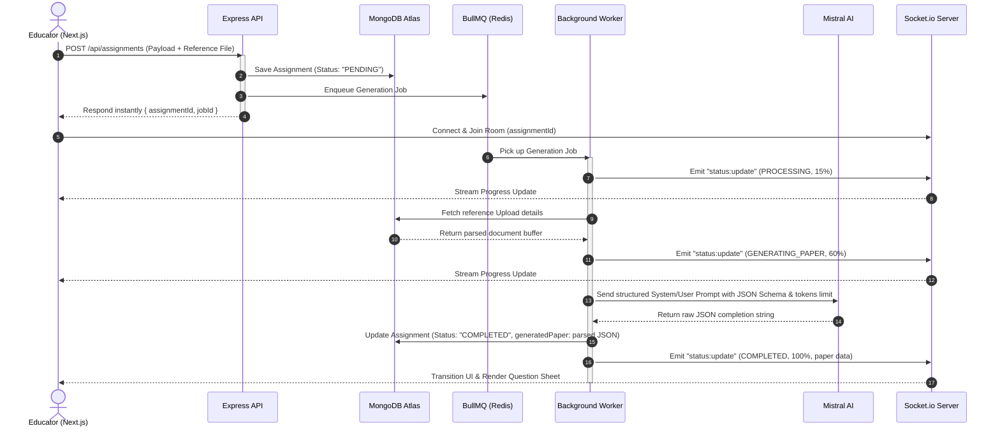

# AssessForge — System Architecture & Workflow

AssessForge is built on an asynchronous, queue-driven event-loop architecture. This document explains how the data pipelines, database models, background queues, and real-time WebSocket channels coordinate.

---

## 📡 End-to-End System Workflow

This diagram illustrates how a user request flows through the asynchronous queue to the database and streams progress updates back to the browser:

---

## 🛡️ Key Technical Design Patterns

### 1. Asynchronous Task Delegation
Generative requests can take several seconds. To prevent Express server blocks, incoming requests are queued immediately to **BullMQ** using **Upstash Redis** as the persistence layer. A background worker processes jobs sequentially, leaving the main HTTP thread free to handle lighter requests.

### 2. Live State Broadcasting (WebSockets)
Socket.io coordinates real-time status updates between the backend worker and the Next.js client. Rather than relying on heavy HTTP polling, the frontend subscribes to an isolated room (`assignmentId`) to receive progress percentage updates natively.

### 3. Fault-Tolerant JSON Parsing & Auto-Repair
LLMs on free tiers are prone to network timeouts or early truncation. We mitigate this on the backend by running raw completions through **`jsonrepair`** before parsing, enabling the system to reconstruct incomplete strings and brackets without crashing.

### 4. Dynamic CSS Print Compilation
To avoid rendering heavy canvas PDFs, we utilize standard browser rendering. By overriding structural layout elements (`html`, `body`, `main`, `div`) directly in the CSS print viewport, the browser's native `window.print()` engine can output clean, centered, and scaled A4 documents.